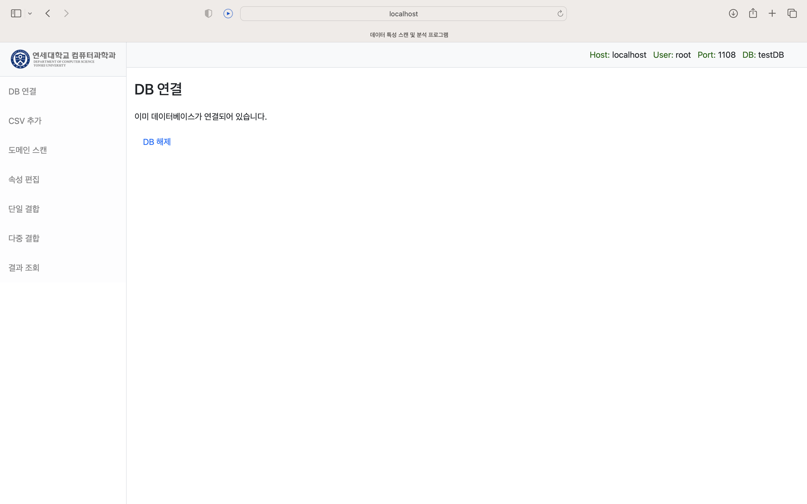

# 2022-2 연세대학교 데이터베이스 수업 FINAL PROJECT
# - 데이터 특성 스캔 프로그램
# db_course

22/12/20 12:30 시점 Django model 없이 Raw SQL로 전부 대체


**DB 등록 시에 TABLE_COUNTS라는 전체 테이블 관리 테이블 생성


**CSV 파일 업로드 시에 해당 CSV파일 정보를 바탕으로 한 테이블 생성 후 TABLE_COUNTS 테이블에도 필요 정보 등록

시작 및 환경설정

1. "프로젝트용 폴더 하나 생성"하고 그 위에서 git clone하기
```git clone https://github.com/mijiFernandes/db_course.git```


2. 필요한 라이브러리 설치
```pip install -r requirements.txt```


3. 마이그레이션 하기

```cd db_course```

```python manage.py migrate```     <== 아마 여기서 아래의 세션까지 다 진행됩니다.

```python manage.py migrate sessions```


4. 로컬 서버 상에서 돌리기
```python manage.py runserver```

 
 

* 메인화면 (DB 연결은 우측의 DB ON/OFF로 확인할 수 있음)


* DB 등록 화면


* DB 등록 완료




* DB 연결 해제


* DB 다중 결합 메인


* DB 다중 결합 대상 검색


* DB 다중 결합 대상 검색 결과


* DB 다중 결합 진행


**현재 전체적인 동작과정


